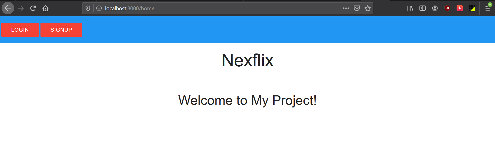
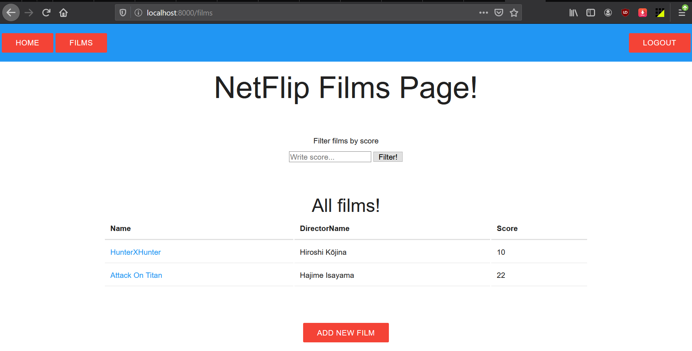

# Nexflix

This is a web server application written in Golang using MVC design.  
This project is based on Netflip project. Complete descriptions are available in utility/description folder.  
Nexflix is a database of information about films. Users can be add, purchase and rate films. Also they can comment on films and search films with desired filters.  

### Features

Home page  
Films page with basic filter  

### TODO

Add film page  
Add add film page  
Add database for films  
Add delete and edit for films  
Add login and signup and logout pages  
Add users with database of their info  
Add 404 page  
Add cookie for login  
Add comment and rate  
Add view of list of published films  
Add list of recommended films  
Add advanced filtering  

## Running

1. Set GoPath to current directory
2. Run Command "go run ./src/main/main.go"
3. Use localhost:8000/home at browser

